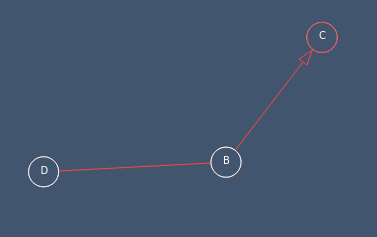
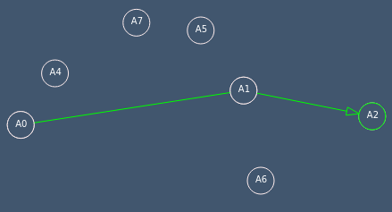
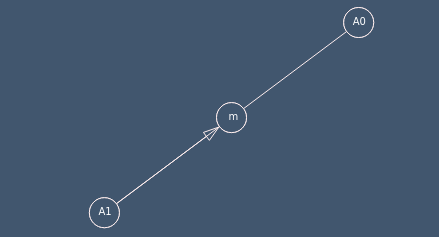
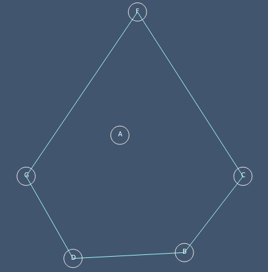
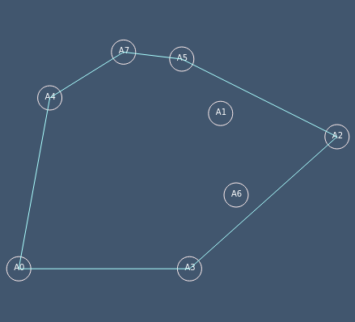
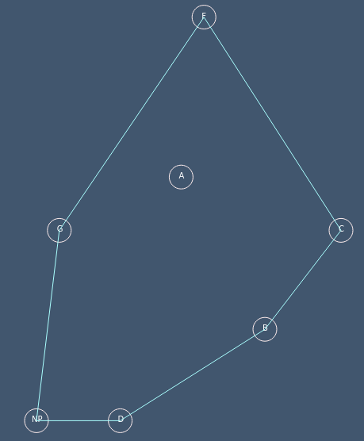

# TP-enveloppe-Convexe
>Le but de ce TP était de calculer des enveloppes convexes à partir d'ensembles de points en implémentant trois algorithmes, demi-plan, Jarvis et Graham.

+  **Exercice 1 :**  
  +  Déterminant : Pour la première partie, on devait implémenter la fonction ***déterminant***, qui permettait de calculer le déterminant entre deux vecteurs.

  +  Signe du déterminant : Ensuite, on devait faire la fonction ***detSing*** qui retournait le signe du déterminant. 

  +  Tour : Et enfin, l'implémentation de la fonction ***tour*** qui retournait *+1* si les trois points sont orientés dans le sens trigo (tour gauche), *-1* si les points sont orientés dans le sens indirect (tour droit) ou *0* si les points sont alignés.

  +  résultat de l'exercice 1 :

    
    
    

+  **Algo de Jarvis (Exo 3)**  :
    +  explication : \
    Cette algorithme retourne un tableau de points qui constitue l'enveloppe convexe. Le principe est de partir du point le plus "bas" et de trouver le point le plus à droite du point courant, c'est pourquoi, pour l'implémenter, il fallait créer deux autres fonctions : ***findNextIdx*** et ***findMinIdy***.

        +  findMinIdy  : Cette fonction permet de trouver le point le plus en "bas", c'est-à-dire, le point qui a le minimum en y.

        +  findNextIdx  : 
        Cette fonction trouve le point qui est le plus à droite du point courant. Elle utilise la fonction ***tour***.
    
    +  résultat de l'algo :
        
         
        
    

+  **Ajout/Suppression d'un point (Exo 7)** :
    +  Ajout : \
    Cette fonction permet d'ajouter un point à l'ensemble de départ. Elle retourne le nouvel ensemble contenant les points initiaux et le nouveau point. Sur l'image ci-après, le point ajouté est nommé ***NP***. 
        
         

    +  Suppression : \
    Cette fonction permet de supprimer un point de l'ensemble résultant de l'algo de Jarvis. Elle retourne le nouvel ensemble sans le point que l'on a supprimé. Pour l'exemple, j'ai choisi de supprimé le point que j'avais ajouté au-dessus. On s'aperçoit que l'on obtient le même résultat que le résultat par l'algo de Jarvis.

         
